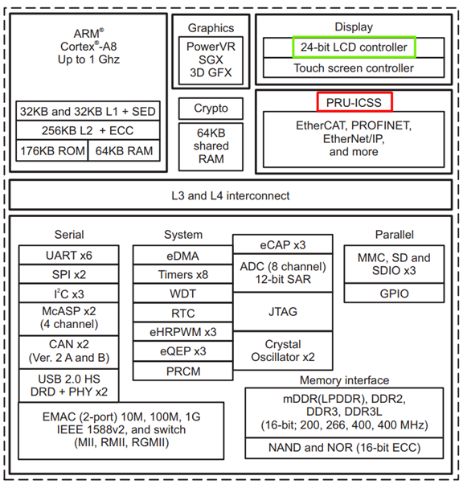
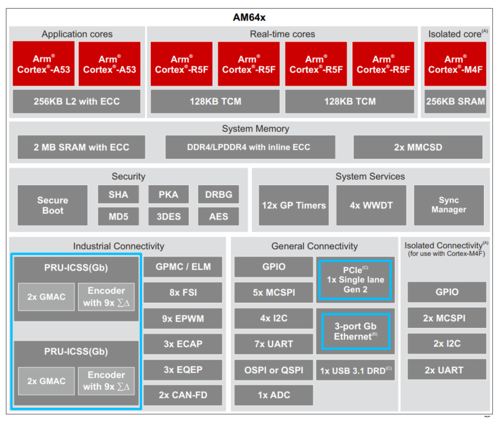

PRU TFT LCD RGB controller
===========================================================================

When we choose TI's processor as the main processor for the P5 redesign, we are faceing problem. P53 has a 4.3-inch color display with a resolution of 480*272 pixels, refresh rate of 60Hz, and color depth of 16.7M. 
Neither the AM64 nor the AM24 series has a LCD controller intergrated. If we use TI's AM3353 series like we used with P7 :numref:`Figure %s <Diagram2-1>`, although AM3352 has a LCD controller, it only has one PRU and lacks a PCIe channel. 

.. _Diagram2-1:

   
   AM335x Functional Block Diagram

So AM3353 can't meet the IO expansion requirements of P5, and we have no PCIe channel for inter-chip communication between main and co-processor,AM64/24 series :numref:`Figure %s <Diagram2-1>` has more PRU/Ethernet ports and PCIe lane. In other words, if we don't solve the display issue, we might have to look for another solution, such as adding another ARM processor or going back to the FPGA route, which is not what we want. 

.. _Diagram2-2:

   
   AM64x Functional Block Diagram

.. raw:: html

	Therefore, the only possibility is that we need to use the PRU to emulate the RGB display timing logic (using assembly language) in AM24. This is not easy due to the sequential execution logic of assembly language and the efficiency of memory access. However, it would bring significant benefits and allow us to finalize the architecture of the P5 redesign.

The Programmable Real-time Unit (PRU) is a small processor core that is tightly integrated with an IO 
subsystem, offering low-latency control of IO pins. The TI Sitara family of devices offer three flavors of PRU 
Subsystem. In P5 design, it can replace FPGA to implement some features including DI/DO/ARC control and read feedback.

.. _example-pdf:

PRU assembly language guide: :download:`PRU Assembly Instruction User Guide.pdf <_static/pdf/PRU Assembly Instruction User Guide.pdf>`

.. toctree::
   :maxdepth: 2
   :caption: PRU RGB driver

   section1
   section2
