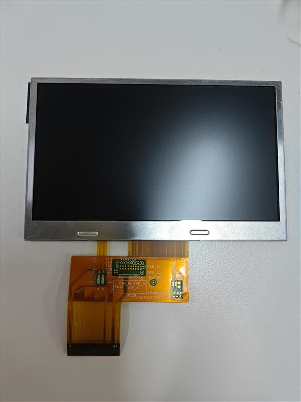
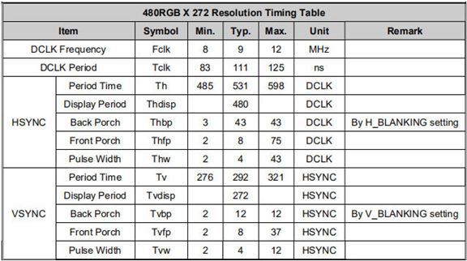
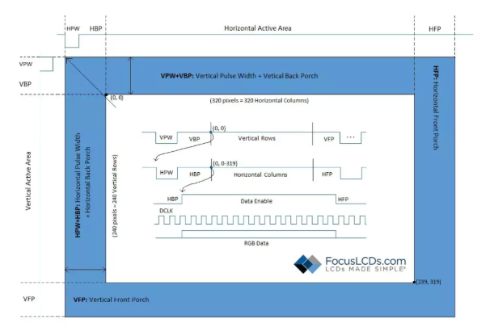
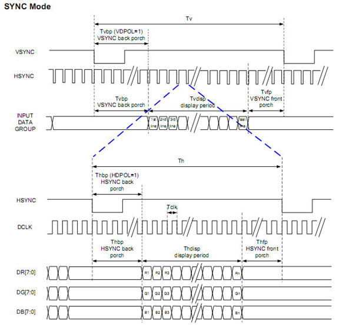
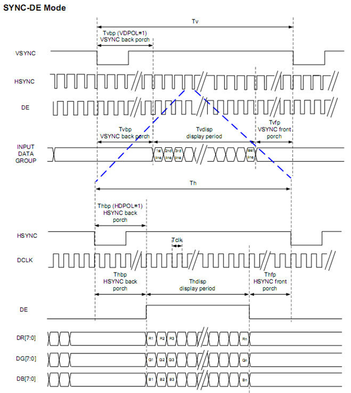
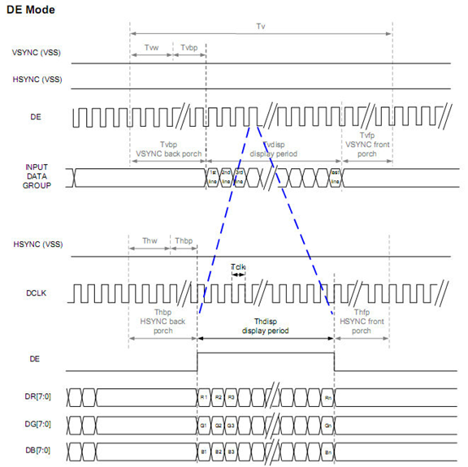

RGB Signals and Timing Diagrams
------------------------------------------------------------------------------

P5 color LCD
**************************

The RGB interface drives the display by sending 16, 18, or 24-bits of RGB data through parallel lines. This data is then mapped by control signals to specify where and when these pixels should be displayed. The common control signals are HSYNC, VSYNC, DCLK, and DE and can be unique to each display. The timing parameters and diagrams for these signals can be found in the data sheet of the display. This note will describe how to read and calculate the necessary timing information from the display’s data sheet.

P5 used display offers a 16, 18 or 24-bit RGB interface. The display has a resolution of 480×272 pixels and that are arranged in and RGB vertical stripe. Additionally, this display has a color depth of up to 16.7M colors. 

.. _Diagram4:

   
   P5 4.3 inch color LCD
   
The front and back porches are used to specify the active area that will be visible on the display. Beginning at the first row, the HSYNC signal will be pulsed for each horizontal column on the display. During this period the RGB data is transmitted each DCLK and confirmed by the DE signal that the data is valid and within the HSYNC active area. This process is then repeated for every vertical row on the display. The following diagram elaborates the sequence of events.   

RGB timing
**************************

   
   RGB-Timing
   
The specific timing values will need to be evaluated from the data sheet and controller spec sheet.
The timing parameters will be needed to function the display and will also be used to calculate the required memory allocation and processing speed of the external CPU. The necessary values are as follows:

   
   RGB-Timing parameters
   
From this data we can calculate the following parameters:

Total Line Cycles:H_ACTIVE(480) + H_FPORCH(43) + H_BPORCH(12) = 535 DCLK

Vertical Frame: VBP + VFP + VDISP = 12 + 8 + 272 = 292 Lines/Frame

Full Frame: 535 DCLK/Line * 292 Lines/Frame = 156,220 DCLK’s/Frame

Frame Rate at DCLK = 9 MHz clock speed: 9 MHz/156,220  = 57.6 Hz

This Frame Rate is the median value of the oscillation frequency required to refresh the display in order to maintain an image. The minimum and maximum values can be calculated similarly from the data.

Maximum DCLK frequency is given at 12MHz. Therefor maximum frame rate achievable by the controller is 12MHz/156,220 = 76.8 Hz.

PRU memory access limitations of the PRU can also prevent the refresh rate from reaching 60Hz, which will be explained later

RGB Interface
**************************

   
   SYNC Mode
   

   
   SYNC-DE Mode
   

   
   DE Mode

.. seealso:: more ref :doc:`/chapter1/section1`。